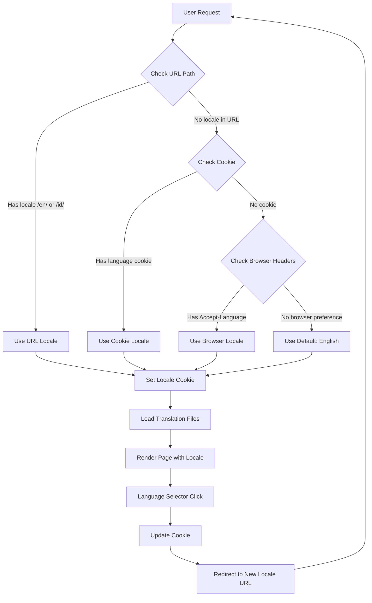
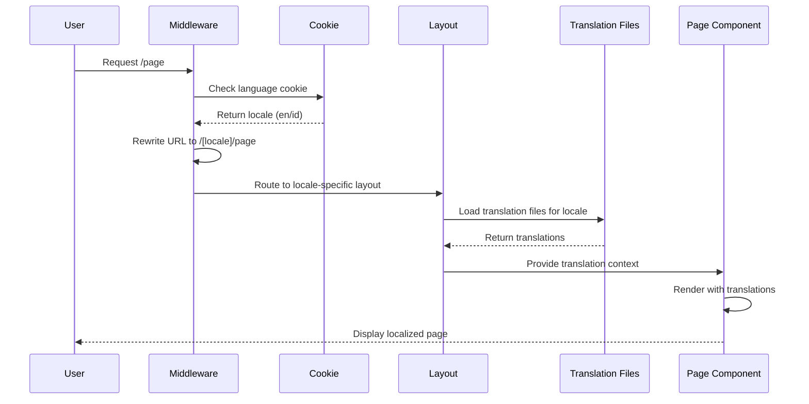
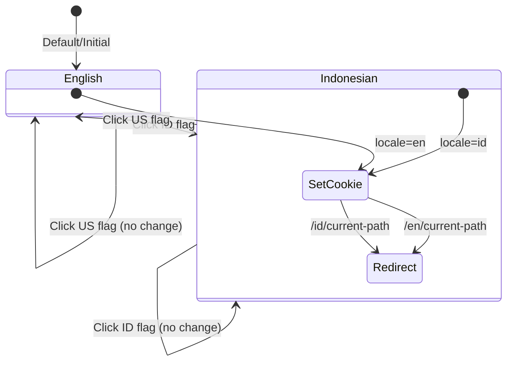

# Localization Architecture Diagram

## System Flow



## Component Architecture

```mermaid
graph TB
    subgraph "App Structure"
        A[middleware.ts] --> B[Locale Detection]
        B --> C[URL Rewriting]
        C --> D[app/[locale]/layout.tsx]
        D --> E[Translation Provider]
    end

    subgraph "Translation System"
        F[i18n.ts] --> G[Locale Config]
        H[locales/en/] --> I[English Translations]
        J[locales/id/] --> K[Indonesian Translations]
        G --> I
        G --> K
    end

    subgraph "Components"
        L[Header.tsx] --> M[Language Selector]
        N[Page Components] --> O[useTranslations Hook]
        P[Shared Components] --> O
        E --> O
        I --> O
        K --> O
    end

    subgraph "Storage"
        Q[Cookie Storage] --> R[Language Preference]
        M --> Q
    end
```

## File Structure Flow

```mermaid
graph LR
    A[User visits /] --> B[middleware.ts detects no locale]
    B --> C[Checks cookie: none]
    C --> D[Checks browser: en-US]
    D --> E[Sets locale: en]
    E --> F[Redirects to /en/]
    F --> G[app/[en]/layout.tsx]
    G --> H[Loads locales/en/ files]
    H --> I[Renders page with English]

    J[User clicks Indonesian flag] --> K[Sets cookie: id]
    K --> L[Redirects to /id/]
    L --> M[app/[id]/layout.tsx]
    M --> N[Loads locales/id/ files]
    N --> O[Renders page with Indonesian]
```

## Data Flow for Translations



## Language Selector Interaction


